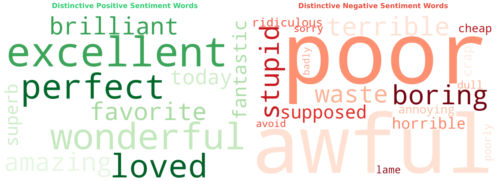
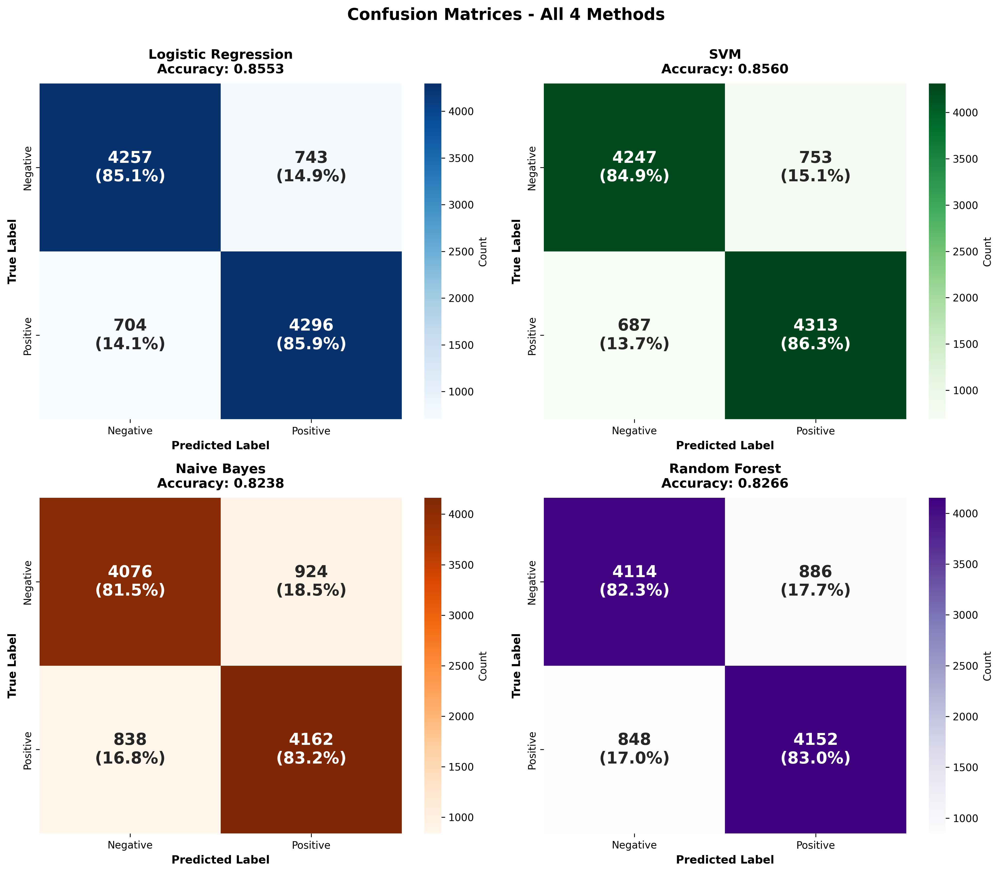
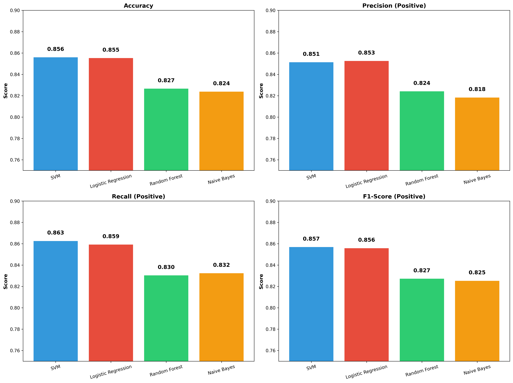

# 🎬 IMDB Sentiment Analysis: Machine Learning Model Comparison

[](https://www.python.org/downloads/)
[](LICENSE)
[](https://www.kaggle.com/datasets/lakshmi25npathi/imdb-dataset-of-50k-movie-reviews)
[](https://leilaksol.github.io/sentiment-analysis-imdb/)

> A comprehensive comparison of 4 machine learning algorithms for sentiment classification on the IMDB movie reviews dataset.

**🔗 [View Live Portfolio](https://leilaksol.github.io/sentiment-analysis-imdb/)**

## 📊 Visualizations

### Word Clouds


### Confusion Matrices


### Performance Metrics


---

## 🛠️ Installation

```bash
# Clone repository
git clone https://github.com/leilaksol/sentiment-analysis-imdb.git
cd sentiment-analysis-imdb

# Create virtual environment
python -m venv venv
source venv/bin/activate  # Windows: venv\Scripts\activate

# Install dependencies
pip install -r requirements.txt

# Download dataset from Kaggle
# Place IMDB Dataset.csv in data/ folder
```

---

## 🚀 Usage

```bash
# Run analysis notebook
jupyter notebook project_v02.ipynb
```

Or use Python:

```python
import pandas as pd
from sklearn.feature_extraction.text import TfidfVectorizer
from sklearn.linear_model import LogisticRegression

# Load data
df = pd.read_csv('data/IMDB Dataset.csv')

# Train model
vectorizer = TfidfVectorizer(max_features=5000)
X = vectorizer.fit_transform(df['review'])
y = df['sentiment'].map({'positive': 1, 'negative': 0})

model = LogisticRegression()
model.fit(X, y)
```

---

## 📁 Project Structure

```
sentiment-analysis-imdb/
├── visualizations/          # All charts and figures
│   ├── word_clouds/
│   ├── confusion_matrices/
│   └── metrics/
├── data/                    # Dataset (download from Kaggle)
├── index.html               # Portfolio webpage
├── project_v02.ipynb        # Main notebook
└── README.md                # This file
```

---

## 🔮 Future Work

- Deep learning models (LSTM, BERT)
- Word embeddings (Word2Vec, GloVe)
- Hyperparameter optimization
- REST API deployment
- Multi-class sentiment analysis

---

## 👩‍💻 Author

**Leila Soltani** - Data Science & ML Engineer

[](https://www.linkedin.com/in/leilak-soltan/)
[](https://github.com/leilaksol)
[](https://leilaksol.github.io/)

---

## 📄 License

MIT License - see [LICENSE](LICENSE) file

---

## 🙏 Acknowledgments

- Dataset: [Kaggle IMDB Dataset](https://www.kaggle.com/datasets/lakshmi25npathi/imdb-dataset-of-50k-movie-reviews)
- Tools: scikit-learn, pandas, matplotlib, seaborn, plotly

---

<div align="center">

⭐ **Star this project if you found it helpful!** ⭐

**[View Live Portfolio](https://leilaksol.github.io/sentiment-analysis-imdb/)**

</div>
